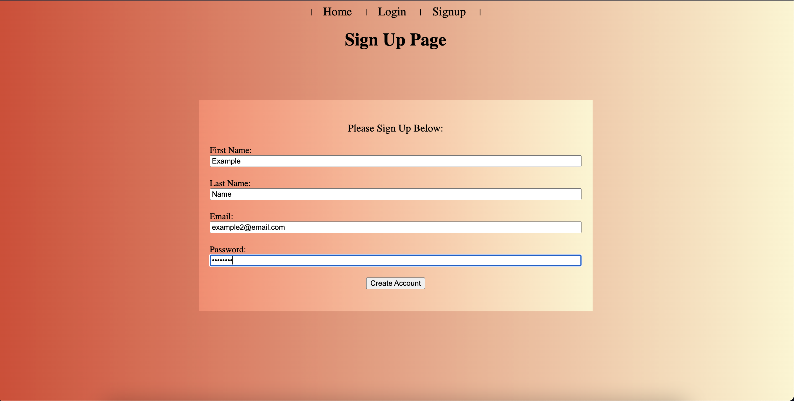
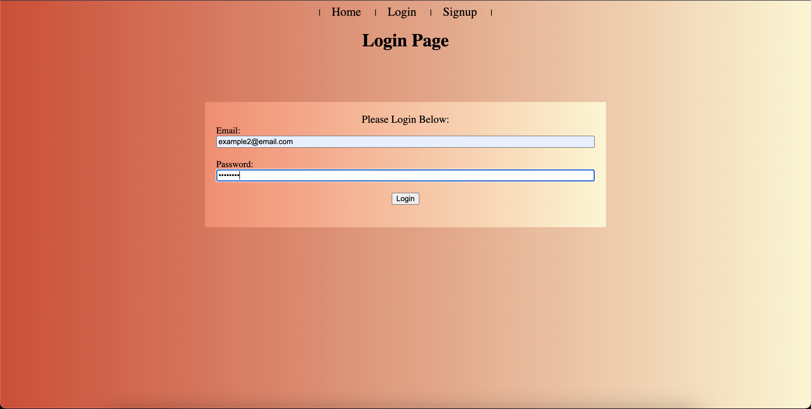
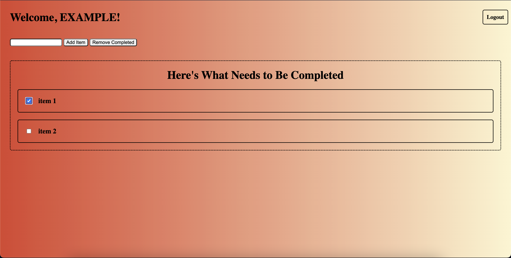

# express-to-do-site
A to do list web app which requires a login then shows the user's to do data obtained from a database.

Data obtained from the login and signup forms are handled by my express backend, which verifies the given credentials against a local MongoDB instance, in the signup section it verifies that there are no users with the same email. In the login section credentials are verified and to-do items pertaining to the user is loaded.

Screenshots
============

